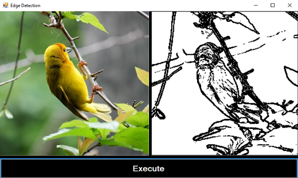

<!-- ABOUT THE PROJECT -->
## About The Project
You can detect edge of an image using Sobel Algorithm.

## Implementation 
Just use these lines of code to get restult

	EdgeDetectorHelper _Detect;
	Bitmap input_bitmap;
	string input = @"C:\1.jpeg";
	input_bitmap = new Bitmap(input);
	if (input_bitmap == null)
		return;
	_Detect = new EdgeDetectorHelper(EdgeDetectorHelper.FilterType.NoEdgeDetection, input_bitmap);
	_Detect.ConvertToGrayScale();
	Bitmap gray_image = _Detect.Bmp;
	//important param: Thresold(range:1-100), lowthresold(range:1-100), sigma (range: 0.1-2.7)
	_Detect = new EdgeDetectorHelper(EdgeDetectorHelper.FilterType.SobelFilter, gray_image);
	_Detect.Threshold = 100;
	_Detect.ApplyFilter();
	_Detect.Bmp.Save(@"C:\test.jpeg");
	
## Output

